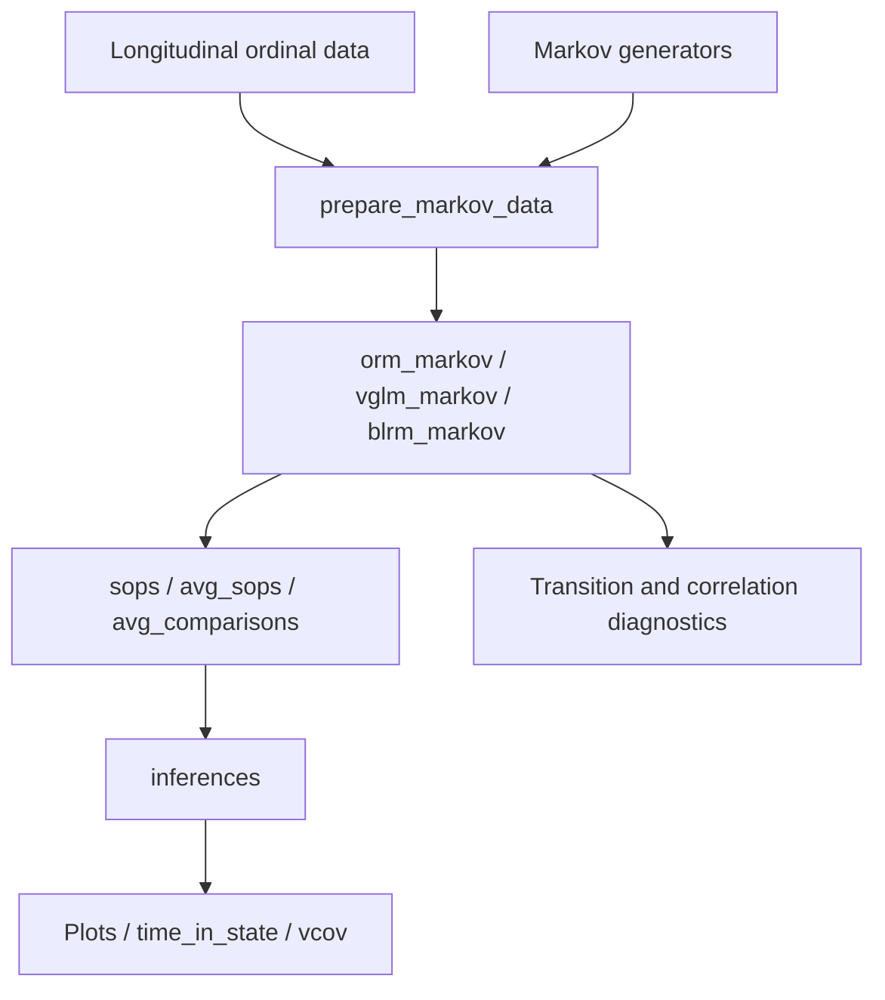

# mostr architecture

## Scope

`mostr` models longitudinal ordinal outcomes using discrete-time Markov
transitions. It retains first- and second-order prediction, absorbing states,
model diagnostics, and uncertainty for state occupancy and treatment contrasts.
It derives from markov.misc while preserving authorship and GPL (>= 2) licensing.
Non-Markov data generators, endpoint analyses, and repeated simulation-study
orchestration are outside this package. Coefficient draws and patient bootstrap
refits remain part of inference for a single fitted model.

## Data flow

## Components and contracts

| Component | Source | Main symbols and role |
|---|---|---|
| Data generation | `R/simulate-markov.R`, `R/lp_violet.R`, `R/simulate-native.R` | `sim_trajectories_markov`, `sim_actt1_markov`, `sim_actt2_markov`; previous-state conditional categorical sampling |
| Data preparation | `R/markov-data.R`, `R/markov-model-data.R` | `prepare_markov_data`; store fitted patient profiles and refit data |
| Model fitting | `R/markov-model-data.R`, `R/vglm_helpers.R`, `R/robcov_orm.R`, `R/robcov_vglm.R` | `orm_markov`, `vglm_markov`, `blrm_markov`; ORM, VGAM, and optional rmsb backends with wrapper provenance |
| Prediction API | `R/sops-api.R`, `R/sops-comparisons.R` | `sops`, `avg_sops`, `avg_comparisons`; individual or averaged probabilities and treatment contrasts |
| Recursion | `R/sops-dispatch.R`, `R/sops-engine.R`, `R/sops-native.R`, `src/sops.cpp` | Native propagation with supported R reference paths; first- and second-order histories |
| Analytical inference | `R/sops-delta-core.R`, `R/sops-delta-unconditional.R`, `R/sops-delta-inference.R` | Native derivative recursion, coefficient uncertainty, and patient sampling contributions |
| Draw and bootstrap inference | `R/sops-inference.R`, `R/sops-inference-draws.R`, `R/sops-bootstrap-inference.R`, `R/sops-score-bootstrap.R`, `R/bootstrap_helpers.R` | `inferences`; MVN draws, posterior draws, ordinary and fractional weighted refits, one-step score bootstrap |
| Summaries | `R/sops-time-in-state.R`, `R/sops-interpolate.R`, `R/sops-delta-accessors.R` | `time_in_state`, `interpolate_sops`, `vcov`; integration, visit-time mapping, covariance subsets |
| Diagnostics and plots | `R/diagnostic-*.R`, `R/viz-*.R` | Occupancy, contrasts, transitions, correlation, variograms, and linear predictor comparisons |

Longitudinal rows use `id`, `time`, `y`, `yprev`, and covariates such as `tx`.
Wrappers preserve the patient starting profiles used when `newdata` is omitted.
Second-order workflows additionally carry `ypprev` or the configured second lag.
The existing `markov_sops`, `markov_avg_sops`, and `markov_avg_comparisons` S3
classes describe result semantics and retain their names. Package-qualified
calls, native registration symbols, and package options use `mostr`.

Conditional variance accounts for coefficient estimation with prediction
profiles held given. Unconditional variance also accounts for sampled patients
and their contribution to coefficient estimation. It is available for supported
averaged results using stored patient profiles; supplied `newdata` requires
conditional variance. Individual results support conditional variance only.

## Dependencies and execution

`VGAM` and `rms` fit frequentist transitions; optional `rmsb` fits Bayesian
models. `cpp11` registers native routines. `mvtnorm` supports coefficient draws;
`future`, `future.callr`, and `furrr` support parallel inference. `ggplot2`
produces plots. `patchwork` is only suggested for vignette composition. Arrow,
sdprisk, survival, and ordinal are not required.

ACTT wrappers call the general Markov generator with published-model
coefficients. The ACTT-2 wrapper accepts `follow_up_time = 60`, which extrapolates
its fitted time effect beyond 28 days. No alternate 60-day calibration is kept.
`violet_baseline` and its source-generation script preserve the original Hmisc
data attribution; see `R/data.R` and `data-raw/violet_baseline.R`.

## Validation

`tests/testthat` retains model, recursion, inference, and diagnostic coverage.
Shared synthetic fixtures use explicit proportional-odds Markov transitions.
Native analytical tests retain an independent test-only R oracle. GitHub Actions
runs R CMD check, address/undefined sanitizers, and Valgrind. The nine vignettes
demonstrate Markov-generated data, including a custom 30-state generator.

Numerical inference snapshots use a relative tolerance of 1e-7 to accommodate
platform-dependent rounding while preserving the stored regression baselines.
