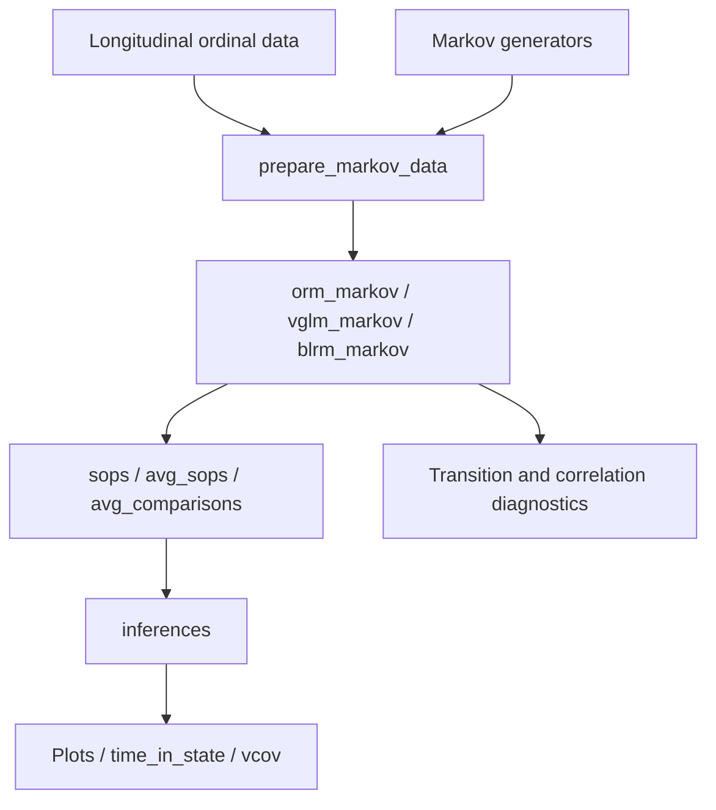

# mostr architecture

## Scope

`mostr` models longitudinal ordinal outcomes using discrete-time Markov
transitions. It retains first- and second-order prediction, absorbing states,
model diagnostics, and uncertainty for state occupancy and treatment contrasts.
It derives from markov.misc while preserving authorship and GPL (>= 2) licensing.
Non-Markov data generators, endpoint analyses, and repeated simulation-study
orchestration are outside this package. Coefficient draws and patient bootstrap
refits remain part of inference for a single fitted model.

## Package website

`_pkgdown.yml` groups the function reference and vignette articles and configures
the navigation for https://scjohannes.github.io/mostr/. pkgdown builds the homepage
from `README.md`, the reference from `man/`, articles from `vignettes/`, and release
notes from `NEWS.md`. Generated files in `docs/` are ignored by Git and excluded
from the R package build.

`.github/workflows/pkgdown.yaml` builds the site with R 4.6.1 on pull requests,
pushes to `main`, and manual runs. Only pushes and manual runs publish, using the
GitHub Pages artifact and deployment actions. In repository Settings > Pages,
the source must be set to GitHub Actions. Local previews use
`pkgdown::build_site()` with Pandoc available; this executes the vignette articles.

`man/figures/logo.png` supplies the README and pkgdown logo. All vignettes source
`vignettes/_setup.R`, which keeps code and figures visible and wraps text output
longer than ten lines in native HTML `details` elements. Non-HTML output retains
the usual knitr formatting. The website workflow sets
`MOSTR_RUN_BAYESIAN_VIGNETTE=true` to execute the Bayesian model and its posterior
predictions; set the same variable for a complete local website build. Routine
package vignette builds retain the existing opt-in for this longer calculation.
Vignette transition heatmaps use up to sixteen evenly spaced visits in grids of
at most four rows and four columns. Observed, fitted, and difference plots share
the same visits, with tile labels omitted for readability.
Vignette correlation heatmaps omit tile labels. `plot_correlation_heatmap()`
chooses a 0-1 fill scale for nonnegative finite correlations and -1 to 1 when
negative values occur or no finite values are available; explicit `fill_limits`
override this choice for both observed and model-based plots.
The introductory vignette documents the ACTT-2 population, NIAID eight-point
health-state scale, and data-access acknowledgment; its 400-patient, 28-day
description matches the simulation code.
Its plot chunks have descriptive names so inserting or renaming other chunks
cannot reuse a previous diagnostic's image URL for a different plot.

## Data flow

## Components and contracts

| Component | Source | Main symbols and role |
|---|---|---|
| Data generation | `R/simulate-markov.R`, `R/lp_violet.R`, `R/simulate-native.R` | `sim_trajectories_markov`, `sim_actt1_markov`, `sim_actt2_markov`; previous-state conditional categorical sampling |
| Data preparation | `R/markov-data.R`, `R/markov-model-data.R` | `prepare_markov_data`; store fitted patient profiles and refit data |
| Model fitting | `R/markov-model-data.R`, `R/vglm_helpers.R`, `R/robcov_orm.R`, `R/robcov_vglm.R` | `orm_markov`, `vglm_markov`, `blrm_markov`; ORM, VGAM, and optional rmsb backends with wrapper provenance |
| Prediction API | `R/sops-api.R`, `R/sops-comparisons.R` | `sops`, `avg_sops`, `avg_comparisons`; individual or averaged probabilities and treatment contrasts |
| Recursion | `R/sops-dispatch.R`, `R/sops-engine.R`, `R/sops-native.R`, `src/sops.cpp` | Native propagation with supported R reference paths; first- and second-order histories |
| Analytical inference | `R/sops-delta-core.R`, `R/sops-delta-unconditional.R`, `R/sops-delta-inference.R` | Native derivative recursion, coefficient uncertainty, and patient sampling contributions |
| Draw and bootstrap inference | `R/sops-inference.R`, `R/sops-inference-draws.R`, `R/sops-bootstrap-inference.R`, `R/sops-score-bootstrap.R`, `R/bootstrap_helpers.R` | `inferences`; MVN draws, posterior draws, ordinary and fractional weighted refits, one-step score bootstrap |
| Summaries | `R/sops-time-in-state.R`, `R/sops-interpolate.R`, `R/sops-delta-accessors.R` | `time_in_state`, `interpolate_sops`, `vcov`; integration, visit-time mapping, covariance subsets |
| Diagnostics and plots | `R/diagnostic-*.R`, `R/viz-*.R` | Occupancy, contrasts, transitions, correlation, variograms, and linear predictor comparisons |

Longitudinal rows use `id`, `time`, `y`, `yprev`, and covariates such as `tx`.
Wrappers preserve the patient starting profiles used when `newdata` is omitted.
Second-order workflows additionally carry `ypprev` or the configured second lag.
The existing `markov_sops`, `markov_avg_sops`, and `markov_avg_comparisons` S3
classes describe result semantics and retain their names. Package-qualified
calls, native registration symbols, and package options use `mostr`.

Conditional variance accounts for coefficient estimation with prediction
profiles held given. Unconditional variance also accounts for sampled patients
and their contribution to coefficient estimation. It is available for supported
averaged results using stored patient profiles; supplied `newdata` requires
conditional variance. Individual results support conditional variance only.

## Dependencies and execution

`VGAM` and `rms` fit frequentist transitions; optional `rmsb` fits Bayesian
models. `cpp11` registers native routines. `mvtnorm` supports coefficient draws;
`future`, `future.callr`, and `furrr` support parallel inference. `ggplot2`
produces plots. `data.table` handles repeated row binding, ordered joins,
grouped reductions, bootstrap row extraction, and baseline selection internally.
`patchwork` is only suggested for vignette composition. Arrow,
sdprisk, survival, and ordinal are not required.

ACTT wrappers call the general Markov generator with published-model
coefficients. The ACTT-2 wrapper accepts `follow_up_time = 60`, which extrapolates
its fitted time effect beyond 28 days. No alternate 60-day calibration is kept.
`violet_baseline` and its source-generation script preserve the original Hmisc
data attribution; see `R/data.R` and `data-raw/violet_baseline.R`.

### Data-frame processing

Public results remain data frames with their existing SOP classes and metadata.
Internal table operations copy inputs with `as.data.table()` and convert results
back with `as.data.frame()`; no caller-owned object is changed by reference.
Binding, joining, and bootstrap extraction retain a base-R path for matrix and
list columns, so matrix-valued model predictors remain intact. The join helper
also uses that path for Cartesian joins and overlapping non-key column names.
Data-table query syntax is enabled only in the functions that use it, including
the bootstrap materializer serialized to parallel workers. Other functions keep
their existing data-frame subsetting semantics.

| Path | Implementation and contract |
|---|---|
| Draw chunks, bootstrap results, diagnostic panels, interpolation pieces | `utils.R`: `bind_rows_fill` uses `rbindlist(use.names = TRUE, fill = TRUE)` and resets row names. |
| Interpolation, time-in-state and empirical plot metadata | `utils.R`: `left_join_preserve_order` uses a typed data-table join, preserves left row/column order and repeated right matches, and permits many-to-many expansion. Missing keys match missing keys, not the literal string `"NA"`. |
| Treatment state-set sums, unweighted averages, time-in-state draw totals | `sops-comparisons-reduce.R`: `aggregate_value` groups observed rows without constructing formulas. It preserves aggregate's missing-value omission, factor levels, and ordering with the first grouping column varying fastest. |
| Weighted averages | `sops-result-helpers.R`: `aggregate_sops_estimates` groups through data.table and retains `weighted_sop_mean`, including missing estimates and zero-total-weight groups. |
| Percentile and Wald intervals | `sops-draws.R`: `compute_ci_from_draws` groups through data.table and retains R's quantile and standard-deviation calculations and point-estimate centering. |
| Patient bootstrap materialization | `bootstrap_helpers.R`: the existing cached row plan still determines sampled copies and row order; data.table extracts the rows without constructing data-frame row names. |
| Repeated-ID prediction data | `markov-model-data.R`: sort a private row-index table by factor-coded ID and visit, then select the first row per ID. This preserves factor ID order, earliest visits, first-row ties, and missing visits ordered last. |

The package-wide review also covered simulation output, model-frame preparation,
backend prediction, analytical inference, diagnostics, reshaping utilities,
vignettes, and dataset creation. Matrix/array construction and native recursions
remain unchanged. Small metadata construction and joins, matrix-to-long reshaping,
the common-grid interpolation matrix path, and one-off vignette/data-generation
code retain their existing implementations. Diagnostic panels benefit from the
shared binder; their specialized aggregates retain their distinct missing-value
rules. No package-wide data-table conversion or thread-setting override is used.

Reproducible local timing scripts, original implementations, and measured results
are in ignored `benchmarks/local/`. Benchmarks include data-frame conversion and
output ordering, check old/new equivalence before timing, and distinguish helper
speedups from whole model fitting or inference performance.

## Validation

`tests/testthat` retains model, recursion, inference, and diagnostic coverage.
Shared synthetic fixtures use explicit proportional-odds Markov transitions.
Native analytical tests retain an independent test-only R oracle. GitHub Actions
runs R CMD check, address/undefined sanitizers, and Valgrind. The nine vignettes
demonstrate Markov-generated data, including a custom 30-state generator.

Numerical inference snapshots use a relative tolerance of 1e-7 to accommodate
platform-dependent rounding while preserving the stored regression baselines.
